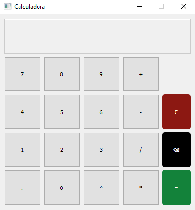

<h1>Calculadora</h1>

<p>Aplicação básica de python com Qt5 para criação de app's, neste caso uma
calculadora digital.</p>

<div align=center>

<h2>
Imagem do projeto
</h2>



</div>

<hr>

<br>

>projeto finalizado

<br>

<hr>

<h2>
Para utilizar a aplicação basta instalar o módulo pyqt5 com o seguinte comando:
</h2>

```
pip install pyqt5
```

<p>Obs.: Recomendo que crie um ambiente virtual em sua máquina.</p>